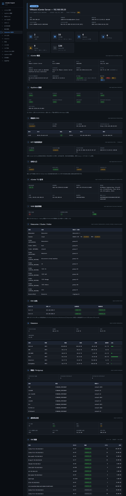
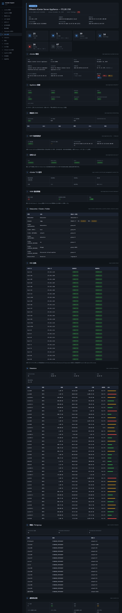

# VMware vCenter Inspect

PowerShell + REST API 写的 vCenter 一键巡检工具,生成工程师风 HTML / Markdown / Word 报告。

- **零依赖** — 只需 Windows PowerShell 5.1+,不装 PowerCLI / pyvmomi
- **Dual-mode** — 自动适配 vCenter **6.5 / 6.7** (`/rest/...`) 与 **7.0 / 8.0+** (`/api/...`) 两套 REST API
- **17 章节** — 概览 / Health / 网络 / NTP / 访问 / 证书 / 备份 / 拓扑 / 主机 / Datastore / 网络 / VM 总览 / VM 列表 / Tools / 服务 / 总体建议 / 免责
- **动态告警** — 基于阈值给出短期 (立即处理) / 中期 (1-2 周) / 长期 (持续改进) 三栏建议
- **三种格式** — HTML (主输出) + DOCX (Word COM 转换) + Markdown (正则转换)

## 截图

vCenter 8.0 (192.168.100.20 — 实验环境):



vCenter 6.5 (172.28.1.150 — 25 台 ESXi 生产环境):



## 快速开始

### 1. 巡检

```powershell
# 最简用法
.\vcenter_inspect.ps1 -VCenter 192.168.100.20 `
                      -Username administrator@vsphere.local `
                      -Password 'YourPassword'

# 跳过 VMware Tools 抽样 (大规模 VM 时省时)
.\vcenter_inspect.ps1 -VCenter 192.168.100.20 -Username ... -Password ... -SkipToolsSample

# Debug 模式 (记录每个 endpoint 的 HTTP code 与返回体到 vcenter_debug_*.log)
.\vcenter_inspect.ps1 -VCenter 172.28.1.150 -Username ... -Password ... -DebugDump

# 指定输出
.\vcenter_inspect.ps1 -VCenter ... -Username ... -Password ... -Output 'C:\reports\xx.html'
```

默认输出: `./report_<vcenter>_<yyyy-MM-dd>.html`

### 2. 转 Markdown

```powershell
.\html_to_md.ps1 -InputPath .\report_192.168.100.20_2026-05-25.html
```

### 3. 转 Word (需本机装 Office Word)

```powershell
.\html_to_docx.ps1 -InputPath .\report_192.168.100.20_2026-05-25.html
```

## 命令行参数 (vcenter_inspect.ps1)

| 参数 | 说明 |
|---|---|
| `-VCenter` | vCenter IP 或 FQDN (必需) |
| `-Username` | 用户名 (必需,推荐 `administrator@vsphere.local`) |
| `-Password` | 密码 (必需) |
| `-Output` | 输出路径,默认脚本同目录 `report_<vc>_<date>.html` |
| `-ToolsSampleSize` | VMware Tools 抽样数 (默认 16) |
| `-SkipToolsSample` | 跳过 Tools 抽样 |
| `-DebugDump` | 把每个 endpoint 的 HTTP code 与返回体写入 `vcenter_debug_*.log` |
| `-Quiet` | 静默运行 |

## 兼容性

| vCenter 版本 | API 风格 | 状态 |
|---|---|---|
| 8.0.x | `/api/...` (v8) | 完整支持,17 章节全部可用 |
| 7.0.x | `/api/...` (v8) | 完整支持 |
| 6.7.x | `/rest/...` (v6, auto-fallback) | 大部分章节可用 |
| 6.5.x | `/rest/...` (v6, auto-fallback) | 核心章节可用,部分 (cert / backup / access / Tools / NTP / Services) 在 6.5 REST 未暴露 |
| < 6.5 | — | 不支持 REST API,请用 PowerCLI |

脚本通过先试 `/api/session` 失败后 fallback `/rest/com/vmware/cis/session` 自动检测,无需手工指定版本。

## Findings 评估规则

| 维度 | 阈值 | 级别 |
|---|---|---|
| Appliance Health (8 项) | yellow / orange | warn,red = critical |
| NTP 列表为空 | — | warn |
| Timesync 模式 ≠ NTP | — | warn |
| DNS hostname = `localhost` 或空 | — | warn |
| DNS server < 2 个 | — | info |
| SSH 启用 | — | warn |
| DCUI 启用 | — | info |
| TLS 证书 < 30 天过期 | — | critical |
| TLS 证书 < 90 天过期 | — | warn |
| 证书自签 (issuer 含 localhost) | — | info |
| 备份 jobs / schedules 双空 | — | warn (两条) |
| Cluster ≥ 2 节点 + HA 关 | — | warn |
| Cluster ≥ 2 节点 + DRS 关 | — | info |
| Datastore 使用率 ≥ 90% | — | critical |
| Datastore 使用率 ≥ 80% | — | warn |
| Datastore 使用率 ≥ 70% | — | info |
| VMware Tools 版本偏旧 | — | info |
| vCenter 补丁状态非 UP_TO_DATE | — | info |

## REST API 8.0 限制 (脚本中已声明,报告免责章节也说明)

REST API 不暴露的部分,本工具不采集,如需补充请用 **PowerCLI** 或 **vSphere SDK (vmodl SOAP)**:

- 单 ESXi 主机详细信息 (CPU/Memory/Build/Uptime/Maintenance Mode) — 端点 deprecated
- VM 快照列表 / 大小
- Alarm / Event / 告警历史
- License 状态 (8.0 REST 返回 404)
- 性能历史曲线 (CPU/Memory/IOPS,stats API 仍是 preview)

## 设计原则

- **零依赖**: 不强迫装 PowerCLI (300+ MB)
- **不修改 vCenter 配置**: 全部 GET / POST `/api/session` 与 DELETE 注销,不写入任何文件到 Appliance
- **工程师风**: HTML 用扁平卡片 + 单色边框 + 表格斑马纹,不做营销式装饰
- **自动重试**: 对 0 / 5xx 瞬时错误自动指数退避重试 (1s/2s/4s),扛 sts-idmd 抖动
- **错误诊断**: 401 / 403 / 5xx / 网络不可达分别给出修复建议

## 已知踩坑 (PowerShell 5.1)

| 坑 | 解法 |
|---|---|
| PS 5.1 默认 ANSI/GBK 读 .ps1 中文乱码 | 脚本必须保存为 **UTF-8 + BOM** |
| `Invoke-RestMethod` 对中文 VM 名 GBK 误解码 | 用 `[System.Net.HttpWebRequest]` 手控 UTF-8 |
| TLS 自签证书拒绝 | `TrustAllCertsPolicy` 类 + `Tls12` |
| `ConvertFrom-Json '[]'` 在 5.1 返回 null | 关键地方写 `if ($null -eq $x) { @() } else { @($x) }` |
| 嵌套 inline-if 子表达式 `$(if(...){...}elseif(...))` 偶尔解析失败 | 预计算到变量,然后引用 |
| `[System.Text.UTF8Encoding]::new($false)` 静态构造在某些 5.1 不可用 | 用 `New-Object System.Text.UTF8Encoding($false)` |

## 文件结构

```
vcenter_inspect.ps1     # 主巡检脚本,生成 HTML
html_to_md.ps1          # HTML → Markdown 转换 (针对本项目结构,正则解析)
html_to_docx.ps1        # HTML → Word 转换 (Microsoft Word COM)
docs/
└── screenshot_*.png    # 报告样张
```

## License

MIT
