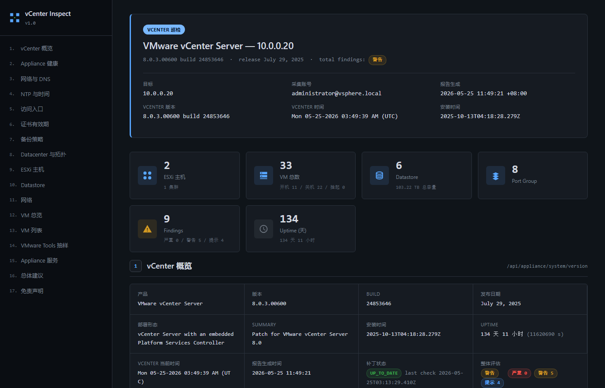

# VMware vCenter Inspect

> PowerShell + REST API 写的 vCenter 一键巡检工具。一条命令 4 秒出一份工程师风 HTML 报告，零依赖，6.5 / 6.7 / 7.0 / 8.0 全兼容。


---

## 目录

- [核心特性](#核心特性)
- [样张报告](#样张报告)
- [快速开始](#快速开始)
- [命令行参数](#命令行参数)
- [报告章节说明](#报告章节说明)
- [Findings 评估规则](#findings-评估规则)
- [兼容性矩阵](#兼容性矩阵)
- [REST API 已知限制](#rest-api-已知限制)
- [自动化场景](#自动化场景)
- [开发与踩坑](#开发与踩坑)
- [路线图](#路线图)
- [Changelog](#changelog)
- [贡献](#贡献)
- [License](#license)

---

## 核心特性

- **零依赖** — 只需 Windows PowerShell 5.1+，不装 PowerCLI / pyvmomi / Python（PowerCLI 仅作为可选回退增强）
- **Dual-mode** — 自动适配 vCenter 6.5 / 6.7（`/rest/com/vmware/cis/...`）与 7.0 / 8.0+（`/api/...`）两套 REST API，无需手工指定版本
- **17 章节** — 概览 / Health / 网络 / NTP / 访问 / 证书 / 备份 / 拓扑 / 主机 / Datastore / 网络 / VM 总览 / VM 列表 / Tools / 服务 / 总体建议 / 免责
- **动态告警** — 18 条评估规则按 critical / warn / info 分级，最后一页自动归类成短期 / 中期 / 长期 3 列建议
- **三种格式** — HTML（主输出）+ DOCX（Word COM 转换）+ Markdown（正则转换），同一份数据
- **工程师风排版** — 扁平卡片 + 单色边框 + 表格斑马纹，无渐变光晕、无营销式装饰，支持打印（Ctrl+P 出 PDF）
- **只读采集** — REST API 全是 GET，DELETE 仅用于注销 session，不修改 vCenter 任何配置

---

## 样张报告



> 首屏效果（侧栏 TOC + 蓝色 metadata banner + Summary 卡片 + 章节 1 数据表）

**完整整页效果**（17 章节全展开 + VM 列表 + 总体建议 + 免责）：[docs/report-preview-full.jpg](docs/report-preview-full.jpg)

**可执行报告**（含 scroll-spy 高亮 / 打印样式 / 鼠标交互）：下载 [`report_demo_2026-05-25.html`](report_demo_2026-05-25.html) 浏览器打开查看。所有数据已脱敏。

---

## 快速开始

### 前置

- 一台 **Windows 跳板机**，能访问 vCenter（HTTPS 443）
- **PowerShell 5.1+**（Windows 10 / 11 / Server 2016+ 自带）或 PowerShell 7+
- 一个 vCenter 账号，**Read-Only 角色**足够（巡检脚本不写入任何数据）

### 安装

```powershell
git clone https://github.com/Aidan-996/VMware_vCenter_Inspect.git
cd VMware_vCenter_Inspect
```

或者只下载主脚本：

```powershell
Invoke-WebRequest `
  -Uri 'https://raw.githubusercontent.com/Aidan-996/VMware_vCenter_Inspect/main/vcenter_inspect.ps1' `
  -OutFile vcenter_inspect.ps1
```

### 第一次跑

```powershell
.\vcenter_inspect.ps1 `
    -VCenter 10.0.0.20 `
    -Username administrator@vsphere.local `
    -Password 'YourPassword'
```

跑完在脚本目录生成 `report_10.0.0.20_<yyyy-MM-dd>.html`，浏览器直接打开。

### 转 Word / Markdown

```powershell
# 出 Word（给领导邮件用，需本机装 Office Word）
.\html_to_docx.ps1 -InputPath .\report_10.0.0.20_2026-05-25.html

# 出 Markdown（接 Wiki / Notion / 博客用）
.\html_to_md.ps1 -InputPath .\report_10.0.0.20_2026-05-25.html
```

### 跑起来终端长这样

```
==============================================
  vCenter Inspection v1.0
  vCenter: 10.0.0.20
  Time: 2026-05-25 11:49:32
==============================================
[ 1/17] (  6%) 登录 vCenter ...
[ 2/17] ( 12%) 拉取 system version ...
[ 3/17] ( 18%) 拉取 appliance health ...
...
[17/17] (100%) 生成 HTML 报告 ...

  采集汇总
  ----------------------------------------------
  ESXi:        N          Datastore:    N
  VM:          N          Portgroup:    N
  Findings:    N (critical=N / warn=N / info=N)
  Elapsed:     N s
==============================================
```

---

## 命令行参数

### vcenter_inspect.ps1

| 参数 | 必需 | 默认 | 说明 |
|---|---|---|---|
| `-VCenter` | ✅ | — | vCenter IP 或 FQDN |
| `-Username` | ✅ | — | 用户名，推荐 `administrator@vsphere.local` |
| `-Password` | ✅ | — | 密码 |
| `-Output` | — | `./report_<vc>_<date>.html` | 输出 HTML 路径 |
| `-ToolsSampleSize` | — | `16` | VMware Tools 抽样数量（开机 VM）|
| `-SkipToolsSample` | — | `false` | 跳过 Tools 抽样，节省 ~10 秒 |
| `-DebugDump` | — | `false` | 每个 endpoint 的 HTTP code + 返回体写入 `vcenter_debug_*.log` |
| `-Quiet` | — | `false` | 静默运行，不打印进度（CI / 计划任务用） |
| `-UsePowerCLI` | — | 自动检测 | 强制启用 PowerCLI 回退（v1.1+，未装则提示 Install-Module） |
| `-SkipPowerCLI` | — | `false` | 强制跳过 PowerCLI 回退（即使已装），只走纯 REST |
| `-Theme` | — | `light` | 报告主题：`light` / `dark` / `minimal` / `amber`（v1.2+） |
| `-AccentColor` | — | — | 单独覆盖主色调，接 hex 如 `#10b981`（v1.2+） |

### 常用组合

```powershell
# 大规模 VM 环境，跳过 Tools 抽样
.\vcenter_inspect.ps1 -VCenter ... -SkipToolsSample

# 指定输出路径
.\vcenter_inspect.ps1 -VCenter ... -Output 'C:\reports\q2-2026.html'

# Debug 模式（首次跑某个新版本 vCenter，看具体哪个 endpoint 401/404）
.\vcenter_inspect.ps1 -VCenter ... -DebugDump

# 静默 + 自定义输出（脚本化调用）
.\vcenter_inspect.ps1 -VCenter ... -Quiet -Output 'C:\reports\daily.html'
```

### 报告主题（v1.2+）

内置 4 套主题，所有章节统一换肤。整体配色集中在 HTML 顶部 `:root` 的 CSS variables，~15 个变量控制 background / foreground / border / accent / 状态色全套。

| 主题 | 风格 | 适用场景 | Background | Accent |
|---|---|---|---|---|
| **`light`** ← 默认 | 白底 + 工程师蓝 | 邮件附件 / 打印 PDF / 公开报告 | `#f5f7fa` | `#1565c0` |
| **`dark`** | 深灰 + 亮蓝 NOC | 大屏 / 24h 监控墙 | `#0f1419` | `#58a6ff` |
| **`minimal`** | 灰白 + 近黑 accent | 极简风偏好 / 黑白打印 | `#fafafa` | `#27272a` |
| **`amber`** | 米色 + 琥珀棕 | 暖色商务 / 客户交付 | `#fdfaf3` | `#b45309` |

> 报告打开后**右上角 4 色圆点**可点击实时切换主题，不用重跑脚本。`localStorage` 持久化用户选择，再次打开同一份 HTML 自动恢复上次主题。`-Theme` 参数现在只决定**首次打开的默认主题**（无 localStorage 时生效）。

```powershell
# 默认 light 主题，不用加参数
.\vcenter_inspect.ps1 -VCenter ...

# 切换内置主题
.\vcenter_inspect.ps1 -VCenter ... -Theme dark
.\vcenter_inspect.ps1 -VCenter ... -Theme amber

# 任何主题 + 自定义主色调（覆盖该主题的 accent）
.\vcenter_inspect.ps1 -VCenter ... -Theme minimal -AccentColor "#10b981"
.\vcenter_inspect.ps1 -VCenter ... -Theme light   -AccentColor "#dc2626"
```

`-AccentColor` 接任意 hex（不验证格式，留权宜 — 误填会破坏渲染但不影响报告生成）。只覆盖 `--accent` 和 `--accent-2`，其余颜色仍走所选主题。

---

### html_to_docx.ps1 / html_to_md.ps1

```powershell
.\html_to_docx.ps1 -InputPath <html>  [-OutputPath <docx>]
.\html_to_md.ps1   -InputPath <html>  [-OutputPath <md>]
```

`-OutputPath` 留空时输出同目录，扩展名替换为 `.docx` / `.md`。

---

## 报告章节说明

| # | 章节 | 数据源 | 说明 |
|---|---|---|---|
| 1 | vCenter 概览 | `appliance/system/version` | version / build / install date / 补丁状态 |
| 2 | Appliance 健康 | `appliance/health/*` | system / storage / mem / swap / load / db / applmgmt / softpkgs 共 8 项 |
| 3 | 网络与 DNS | `appliance/networking/interfaces` + `appliance/networking/dns/*` | 网卡 + hostname / mode / servers |
| 4 | NTP 与时间同步 | `appliance/ntp` + `appliance/timesync` | NTP server 列表 + timesync 状态 |
| 5 | 访问入口 | `appliance/access/*` | SSH / Bash Shell / DCUI / Console CLI 启用状态 |
| 6 | vCenter TLS 证书 | `vcenter/certificate-management/*` | 有效期 / 颁发者 / SAN / 指纹 |
| 7 | VAMI 备份策略 | `appliance/recovery/backup/*` | jobs + schedules |
| 8 | 拓扑 | `vcenter/datacenter` + `vcenter/cluster` + `vcenter/folder` + `vcenter/resource-pool` | DC / Cluster / Folder / ResourcePool 树状关系 |
| 9 | ESXi 主机 | `vcenter/host` | host 列表 + 连接状态 + power state |
| 10 | Datastore | `vcenter/datastore` | 容量 / 已用 / 类型 / 使用率进度条 |
| 11 | 网络 / Portgroup | `vcenter/network` | Standard / Distributed Portgroup 计数 |
| 12 | VM 总览 | `vcenter/vm` | 总数 / 开机 / 关机 / 挂起 + vCPU / 内存汇总卡片 |
| 13 | VM 列表 | `vcenter/vm` | 按 power + vCPU 排序的完整 VM 表 |
| 14 | VMware Tools 抽样 | `vcenter/vm/{vm}/tools` | 开机 VM 抽样调用 Tools 接口 |
| 15 | Appliance 服务 | `appliance/services/*` | 核心 20 项（vpxd / vpostgres / vapi-endpoint / sts-idmd / eam / sps / vsan-health …） |
| 16 | 总体建议 | （动态） | 按 findings 分短期严重 / 中期警告 / 长期提示 3 列 |
| 17 | 免责声明 | （静态） | REST API 限制说明 |

---

## Findings 评估规则

巡检不是单纯打印数据，得有判断。规则按 VMware 官方 best practice + 真实生产环境踩过的坑总结：

| 维度 | 阈值 | 级别 |
|---|---|---|
| Appliance Health 任意项 | yellow / orange | warn |
| Appliance Health 任意项 | red | **critical** |
| NTP 服务列表为空 | — | warn |
| Timesync 状态 ≠ NTP | — | warn |
| DNS hostname = `localhost` 或空 | — | warn |
| DNS server 数 < 2 | — | info |
| SSH 启用 | — | warn |
| DCUI 启用 | — | info |
| TLS 证书剩余 < 30 天 | — | **critical** |
| TLS 证书剩余 < 90 天 | — | warn |
| TLS 证书自签（issuer 含 localhost / VMSCA） | — | info |
| VAMI 备份 jobs 空 | — | warn |
| VAMI 备份 schedules 空 | — | warn |
| Cluster ≥ 2 节点 + HA 关 | — | warn |
| Cluster ≥ 2 节点 + DRS 关 | — | info |
| Datastore 使用率 ≥ 90% | — | **critical** |
| Datastore 使用率 ≥ 80% | — | warn |
| Datastore 使用率 ≥ 70% | — | info |
| VMware Tools 抽样有 OLD 版本 | — | info |
| vCenter update 非 UP_TO_DATE | — | info |

短期 / 中期 / 长期建议按 findings 等级自动归类到第 16 章节，照着做即可，全程不用人工标注。

---

## 兼容性矩阵

### vCenter 版本

| vCenter | REST API 路径 | 状态 |
|---|---|---|
| 8.0 / 8.0U2 / 8.0U3 | `/api/*` | ✅ 完整支持，17 章节全部可用 |
| 7.0 / 7.0U3 | `/api/*` | ✅ dual-mode 路径自动匹配，待社区补实测 |
| 6.7.x | `/rest/com/vmware/cis/*` | ✅ 兼容（路径同 6.5） |
| 6.5.x | `/rest/com/vmware/cis/*` | ✅ 核心章节可用，部分（cert / backup / access / Tools / NTP / Services）6.5 REST 未暴露，对应章节自动 skip |
| < 6.5 | — | ❌ REST API 不全，请用 PowerCLI |

**dual-mode 工作原理**：

1. 登录阶段：先试 `POST /api/session`，401/404 自动 fallback 到 `POST /rest/com/vmware/cis/session`
2. 所有读接口：先 `/api/<path>` → 失败再 `/rest/<path>` → 自动 unwrap 6.5 返回的 `{value}` 包裹
3. 不存在的端点：识别 404 直接 skip 当前章节，渲染为"该版本 API 不支持"，不打断整体巡检

### PowerShell 版本

| PowerShell | 状态 |
|---|---|
| Windows PowerShell **5.1**（Win10/11 自带） | ✅ 主测试环境 |
| PowerShell **7.0+**（Core） | ✅ 兼容 |
| Linux / macOS 上的 pwsh | ⚠️ 理论可用，未实测 |

### 跳板机操作系统

| OS | 状态 |
|---|---|
| Windows 10 / 11 | ✅ |
| Windows Server 2016 / 2019 / 2022 / 2025 | ✅ |
| Linux + pwsh 7 | ⚠️ 未测 |

---

## REST API 已知限制

REST API 8.0 仍未暴露的部分，v1.1 已通过可选 PowerCLI 回退补全。**未装 PowerCLI** 时这几栏空着不糊弄：

- **单 ESXi 主机详细信息**：CPU / Memory / Build / Uptime / Maintenance Mode 在 8.0 端点 deprecated
- **VM 快照列表 / 大小**：REST 能拿快照树，但 size 字段不暴露
- **Alarm / Event / 告警历史**：REST 不提供告警 API
- **License 状态**：`/api/vcenter/licensing/licenses` 在 8.0 返回 404
- **性能历史曲线**：CPU / Memory / IOPS stats API 仍是 preview，字段不稳

**v1.1 PowerCLI 回退已上线** — 检测到 `VMware.VimAutomation.Core` 模块即自动启用，补全：

| REST 拿不到 | v1.1 PowerCLI 补全 |
|---|---|
| 单 ESXi 主机 CPU/Mem/Uptime 实时 | ESXi 主机章节注入"实时运行数据"副表 |
| VM 快照大小 / 年龄 / 链深度 | 新增 **Section 16 VM 快照健康** + Top10 表 |
| 当前 Triggered Alarms | 新增 **Section 17 Alarm 当前告警** |

启用方式：

```powershell
# 一次性安装 (3-5 分钟,首次约 300 MB)
Install-Module VMware.PowerCLI -Scope CurrentUser -Force

# 然后跑脚本即可自动检测
.\vcenter_inspect.ps1 -VCenter ... -Username ... -Password ...

# 或显式开关
.\vcenter_inspect.ps1 ... -UsePowerCLI   # 强制启用
.\vcenter_inspect.ps1 ... -SkipPowerCLI  # 强制跳过 (即使已装)
```

未装 PowerCLI 时这两个新章节会显示"未启用 PowerCLI 回退,跳过"提示，REST 主报告完全不受影响。

---

## 自动化场景

### Windows 计划任务（每周一巡检）

```powershell
$action = New-ScheduledTaskAction -Execute 'powershell.exe' `
    -Argument '-NoProfile -File C:\Tools\vcenter_inspect.ps1 -VCenter 10.0.0.20 -Username administrator@vsphere.local -Password "***" -Quiet -Output C:\Reports\weekly.html'

$trigger = New-ScheduledTaskTrigger -Weekly -DaysOfWeek Monday -At 8:00am

Register-ScheduledTask -TaskName 'vCenter Weekly Inspect' `
    -Action $action -Trigger $trigger -RunLevel Highest
```

### 多 vCenter 批量（临时方案）

```powershell
@(
    @{ vc='10.0.0.20'; out='vc01.html' }
    @{ vc='10.0.0.21'; out='vc02.html' }
    @{ vc='10.0.0.22'; out='vc03.html' }
) | ForEach-Object {
    .\vcenter_inspect.ps1 -VCenter $_.vc `
        -Username administrator@vsphere.local -Password '***' `
        -Output $_.out -Quiet
}
```

> 多 vCenter 原生批量模式（`-VCenter @('vc1','vc2','vc3')` + 对比汇总）在 [v1.3 路线图](#路线图) 中。

### CI / 邮件投递

跑完后用 `Send-MailMessage` 或 `Invoke-RestMethod` 推 Telegram / 飞书 / 钉钉。报告生成后输出码不变，直接读 HTML 体积判断成功。

---

## 开发与踩坑

写这脚本三天，60% 时间花在 PowerShell 5.1 的几个特性坑上：

| 坑 | 解法 |
|---|---|
| PS 5.1 默认按 ANSI/GBK 读 .ps1 → 中文乱码 | 脚本必须存为 **UTF-8 + BOM**，生成时显式 `New-Object System.Text.UTF8Encoding($true)` |
| `Invoke-RestMethod` 对中文 VM 名 GBK 误解码 → `???` 乱码 | 改用 `[System.Net.HttpWebRequest]` 手控 + `[Text.Encoding]::UTF8.GetString()` 读流 |
| TLS 自签证书拒绝 | 注入 `TrustAllCertsPolicy` 类 + `[Net.ServicePointManager]::SecurityProtocol = Tls12` |
| `ConvertFrom-Json '[]'` 在 PS 5.1 返回 `$null`，`@($null).Count = 1` | 关键路径写 `if ($null -eq $x) { @() } else { @($x) }` |
| 嵌套 inline-if 子表达式 `$(if(...){...}elseif(...))` 在 PS 5.1 hashtable value 位置偶尔解析失败 | 预计算到变量，再引用 |
| `[System.Text.UTF8Encoding]::new($false)` 静态构造在部分 PS 5.1 环境不可用 | 用 `New-Object System.Text.UTF8Encoding($false)` 替代 |

### 设计原则

- **零依赖**：不强迫装 PowerCLI（300+ MB）/ 不依赖 Python / 不依赖任何 module
- **只读 + 不留挂**：全部 GET，DELETE 只用于注销 session，脚本退出主动清理
- **工程师风**：HTML 用扁平卡片 + 单色边框，不做营销式装饰
- **自动重试**：对 0 / 5xx 瞬时错误指数退避（1s/2s/4s），扛 sts-idmd 抖动
- **错误诊断**：401 / 403 / 5xx / 网络不可达 / 证书问题分别给出具体修复建议

### 文件结构

```
vcenter_inspect.ps1            # 主巡检脚本，生成 HTML (1250 行)
html_to_md.ps1                 # HTML → Markdown 转换器
html_to_docx.ps1               # HTML → Word 转换器 (依赖 Office Word COM)
report_demo_2026-05-25.html    # 脱敏 demo 报告样张
docs/
├── report-preview.png         # 首屏 hero 图
└── report-preview-full.jpg    # 整页超长效果图
CHANGELOG.md                   # 版本变更日志
README.md                      # 本文件
LICENSE                        # MIT
```

---

## 进度 & 路线图

按优先级排序，欢迎社区参与（提 Issue / PR）。

### v1.0.0 — 已发布（2026-05-28）

- [x] 17 章节完整巡检报告（概览 / Health / 网络 / NTP / 证书 / 备份 / 拓扑 / VM …）
- [x] Dual-mode REST API，自动适配 vCenter 6.5 / 6.7 / 7.0 / 8.0
- [x] 18 条 Findings 评估规则 + 短 / 中 / 长期建议动态归类
- [x] 三种输出：HTML（主）/ Markdown / Word（Office COM）
- [x] 自动重试（指数退避 1s/2s/4s）+ 401/403/5xx 错误诊断
- [x] UTF-8 中文 VM 名支持（手控 `HttpWebRequest`，绕过 PS 5.1 GBK 解码）
- [x] 完整文档：README / CHANGELOG / LICENSE / Demo 报告 / 截图样张

### v1.1.0 — 已发布（2026-06-19）

- [x] **PowerCLI 回退层** — 检测到 `VMware.VimAutomation.Core` 自动启用，补 REST 拿不到的 VM 快照大小、当前 Alarm、Host 实时负载
- [x] HTML 报告新增 2 章节（**Section 16 VM 快照健康** + **Section 17 Alarm 当前告警**），ESXi 主机章节注入实时副表
- [x] 新增 10 条 PowerCLI 维度 Findings 规则（Memory ≥ 90% critical / 快照 > 90 天 critical / RED alarm 等）
- [x] 优雅降级：未装 PowerCLI 时这两章节显示提示，REST 主报告完全不受影响
- [x] 新增参数 `-UsePowerCLI` / `-SkipPowerCLI`

### v1.2.0 — 已发布（2026-06-19）

- [x] **报告主题系统** — 4 套内置主题（light 新默认 / dark NOC / minimal / amber），通过 `-Theme` 选默认
- [x] **报告内实时切换** — 右上角 4 色圆点切换器，点击秒换肤，`localStorage` 持久化偏好
- [x] **主色单独覆盖** — `-AccentColor` 参数接任意 hex，强制覆盖所有主题的 accent
- [x] CSS 架构重构：`:root` 拆为 `[data-theme="..."]` 4 个选择器块，扩展新主题只加 palette
- [x] 体积影响：报告 ~42 KB → ~45 KB（+3.5 KB）；`@media print` 自动隐藏切换器

### v1.3 — 计划中

| 优先级 | 项目                | 说明                                                                            | 状态        |
| ------ | ------------------- | ------------------------------------------------------------------------------- | ----------- |
| P0     | 多 vCenter 批量     | `-VCenter @('vc1','vc2','vc3')` 一次跑一组 + 生成对比汇总报告                    | 待启动      |
| P1     | Findings 基线对比   | 跟上次结果 diff，只输出新增 / 已解决告警，便于做周报                              | 待启动      |
| P1     | 7.0 / 7.0U3 实测     | 路径已通过 dual-mode 自动匹配，缺真实环境验证                                    | 求社区帮跑  |
| P2     | `-RetryOnLoginFail` | sts-idmd 慢启动时登录阶段也走指数退避                                            | 待启动      |

### v1.4 — 设想中

| 项目                 | 说明                                                            |
| -------------------- | --------------------------------------------------------------- |
| Telegram / 飞书 / 钉钉 | `-Notify <bot-cfg.json>` 参数，跑完推 findings 摘要               |
| 配置文件化           | 阈值（`SSH_WARN` / `DS_CRITICAL_PCT` …）从 `inspect.config.json` 读 |
| 历史趋势图           | 多次巡检数据写 SQLite，HTML 报告嵌 Chart.js 折线                  |
| Health 整体评分      | 参考 vROps 给 vCenter 健康度打 0-100 分                          |
| 国际化               | 英文报告模板（i18n key 抽离）                                    |

### v2.0 — 远期

| 项目                | 说明                                                |
| ------------------- | --------------------------------------------------- |
| 多 vCenter Web 控制台 | Flask / FastAPI dashboard，所有 vCenter 状态聚合      |
| ESXi 直连模式       | vCenter 故障时直接走 ESXi REST / SSH 拉单机状态       |
| vSAN 健康专题章节   | vSAN 集群独立打分（disk group / object health …）    |
| 容器化部署          | Docker 镜像 + 计划任务模板 + helm chart              |
| 报告 diff 可视化    | 两次报告做并排对比 HTML（左旧右新，高亮变化）         |

### 想参与？

- **跨版本兼容反馈** — 手头有 7.0U3 / vSAN 环境的，跑一次贴个截图就帮大忙了
- **新 Findings 规则** — 你踩过的坑觉得应该被巡检抓出来，提 PR 加规则
- **新章节** — vROps / Site Recovery Manager / NSX 数据采集延伸

---

## Changelog

完整历史见 [CHANGELOG.md](CHANGELOG.md)。

- **v1.0.0** (2026-05-25)：首发，17 章节 + dual-mode + Findings 评估 + HTML/MD/DOCX 三种格式

---

## 贡献

欢迎所有形式的贡献，特别是：

- **跨版本兼容性反馈**：7.0U3 / 8.0U2 / 8.0U3 / vSAN 环境帮跑一次 + 提 Issue 反馈结果
- **新 Findings 规则**：你踩过哪些坑觉得应该被巡检抓出来，提 PR 加规则
- **Tools 适配**：vRA / vRO / NSX 适配延伸

### 提 Issue 时请附

1. vCenter 版本（精确到 build，从 vSphere Client 右上角 ?）
2. PowerShell 版本（`$PSVersionTable.PSVersion`）
3. 复现命令（去掉密码）
4. `-DebugDump` 模式生成的 `vcenter_debug_*.log`（去掉环境内 IP）

### 开发约定

- PowerShell 脚本必须保存为 **UTF-8 + BOM**（PS 5.1 兼容要求）
- 新增章节遵循 `Section-XX-<name>` 命名 + 同步 Eval-Findings 评估规则
- 不引入新依赖（保持零依赖原则）

---

## License

[MIT](LICENSE) © 2026 [Aidan-996](https://github.com/Aidan-996)

---

## 相关项目

- [Linux Auto Inspection](https://github.com/Aidan-996/Linux_Auto_Inspection) — 同款工程师风的 Linux 一键巡检（Bash）

---

如果这个工具帮你省下手工出报告的时间，欢迎在仓库点 Star 让更多人看到。问题 / 建议 / 兼容性反馈，[提 Issue](https://github.com/Aidan-996/VMware_vCenter_Inspect/issues) 即可。
